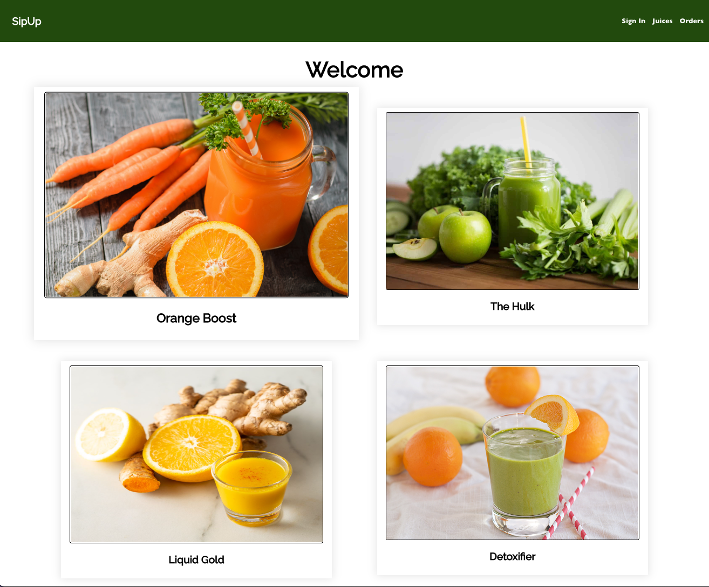
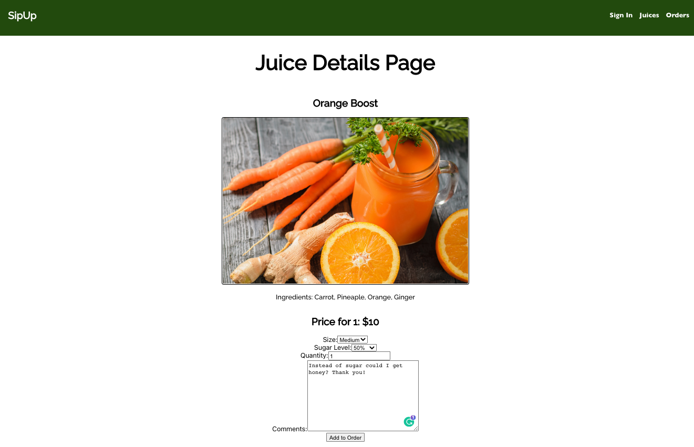
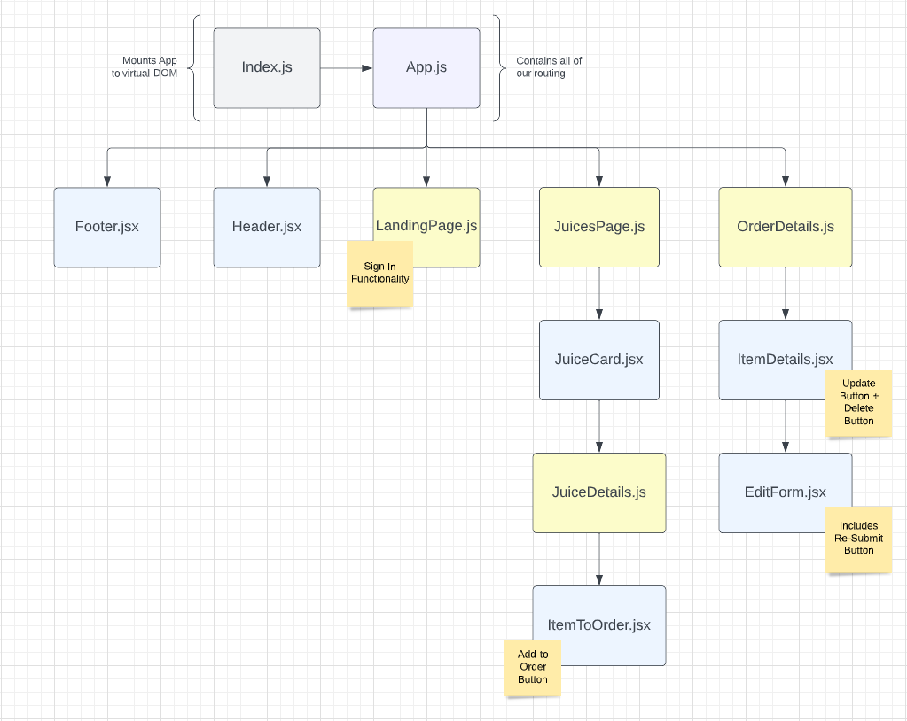
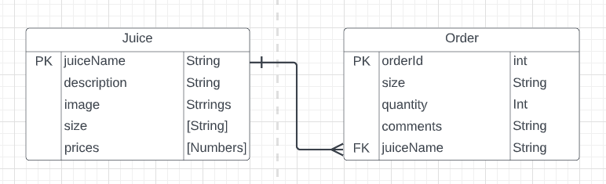

# SipUp

## Date: 07/25-29/2022

### By: Anaflavia Almendras

#### [SipUp](https://evening-woodland-13843.herokuapp.com/juices) | [GitHub](https://github.com/A-Almendras) | [LinkedIn](https://www.linkedin.com/in/aalmendras/)

---

---

### **_Description_**

##### SipUp is a juice bar application in where a user is able to order their juices of choice based on what juices are available. Once the user clicks on the drink they will be brought to the Juice Details Page in where they are able to select size, sugar level, qty, and any comments you'd like us to know about the order. Once they click 'Add to Order', the user can find their orders in the navigation section. There they can update an existing or delete the order all together.

---

### **_Technologies_**

- Javascript, JSX, CSS
- React.js
- MongoDB
- Mongoose
- Express
- Node.js
- Heroku
- Atlas

---

### **_Project Overview_**

##### Once the user clicks on the drink they will be brought to the Juice Details Page in where they are able to select size, sugar level, qty, and any comments you'd like us to know about the order. Once they click 'Add to Order', the user can find their orders in the navigation section. There they can update an existing or delete the order all together.

##### --

##### A Trello board was used to keep track of development progress and can be viewed [here](https://trello.com/b/fgfsLOnm/project-2-sip).

##### The project itself was deployed and can be viewed [here](https://evening-woodland-13843.herokuapp.com/juices).

---

### **_Screenshots_**

##### **Component Hierarchy Diagram**

##### **ERD**

---

### **_Future Updates_**

- [ ] Improve styling all trhoughout pages.
- [ ] Sign in page that grabs the name of client and puts it in the welcome page.
- [ ] Make sign in a pop up.
- [ ] Add status of order.
- [x] Ability to update an item once added to order.

---

### **_Credits_**

##### MDN: [MDN Search](https://developer.mozilla.org/en-US/)

##### All my instructors and peers.
